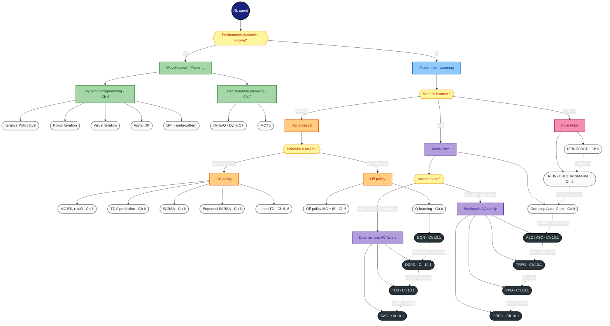
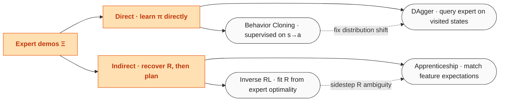
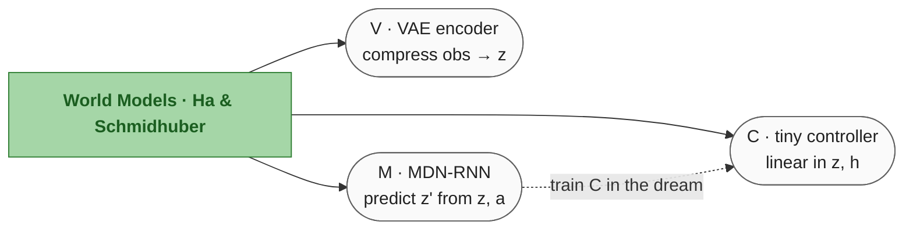
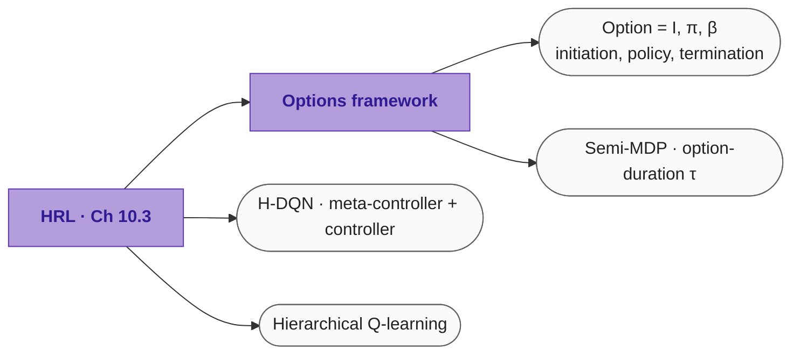

# RL algorithms — classification map

> A clean Mermaid version of the hand-drawn taxonomy, covering **every algorithm in `lectures/`** organised on the classical three axes: **model-based vs model-free** · **value vs policy vs actor-critic** · **on-policy vs off-policy**.
> **Out of scope** (per request): Ch 2 bandits and Ch 10.3 MARL.

---

## How to read the map

- **Solid arrows** = taxonomy (is-a)
- **Dotted arrows** = algorithm lineage (X's successor fixes a problem of X)
- **Hexagons** = the question being asked at that fork
- **Stadium nodes** = concrete algorithms (with their chapter ref)
- **Dark-grey nodes** = deep-RL extensions (neural-net-parameterised version of a tabular ancestor)
- **Colour bands**:
  - 🟩 green = model-based / planning
  - 🟦 blue = model-free / learning
  - 🟧 orange = value-based
  - 🟪 pink = pure policy
  - 🟨 purple = actor-critic
  - ⬛ dark = deep RL

---

## The big picture

---

## Lineage — what each dotted arrow means

### Stochastic policy chain
`REINFORCE → … → GRPO`

| Step | What it adds | Why |
|---|---|---|
| `+ baseline` | subtract `b(s)`, usually `v̂(s, w)` | cut variance without bias |
| `+ bootstrap critic` | replace `Gₜ` by TD error `δ` | online, even lower variance |
| `parallel · advantage` | A2C/A3C: many workers, `A = Q − V` | scale + decorrelation |
| `trust region · KL` | TRPO: largest step with `KL(πθ ‖ πθ_old) ≤ δ` | stop policy collapse |
| `clip ratio` | PPO: clip `r = πθ/πθ_old` to `[1−ε, 1+ε]` | TRPO without 2nd-order math |
| `group-relative` | GRPO: drop the value baseline | use group-normalised advantage |

### Deep value + deterministic chain
`Q-learning → … → SAC`

| Step | What it adds | Why |
|---|---|---|
| `+ deep net + target + replay` | DQN: NN `Qφ`, target net `φ⁻`, replay buffer | stabilise the deadly triad |
| `continuous · actor μθ` | DDPG: replace `maxₐ Q` by `Q(s, μθ(s))` | gradient flows through actor |
| `twin Q · delayed` | TD3: `min(Qφ₁, Qφ₂)` + slow actor update | curb overestimation |
| `+ max entropy` | SAC: add `α · H(π(·|s))` to objective | exploration + smoother optima |

---

## Confusables — Q-learning · DQN · DDPG comparison

The trio that gets mixed up in exams (and in the hand-drawn map's top-left table):

| | **Q-learning** (Ch 6) | **DQN** (Ch 10.1) | **DDPG** (Ch 10.1) |
|---|---|---|---|
| Action space | discrete | discrete | **continuous** |
| Function form | tabular `Q(s, a)` | NN `Qφ(s, a)` | NN `Qφ(s, a)` + actor `μθ(s)` |
| Policy | implicit (greedy on Q) | implicit (argmax NN) | explicit actor `μθ` + noise |
| Off-policy? | ✓ | ✓ | ✓ |
| Bootstrapping? | ✓ | ✓ | ✓ |
| Update target | `r + γ maxₐ' Q(s', a')` | same | `r + γ Qφ′(s', μθ′(s'))` |
| Stability tricks | none | target net + replay | target net + replay + **Polyak avg** |
| How action picked | tabular `argmax` | NN `argmax` | `μθ(s)` + exploration noise |

---

## Orthogonal axes — apply to *almost any* algorithm above

These are choices you make on top of the main taxonomy:

| Axis | "Plain" side | Extension side |
|---|---|---|
| **Function form** (Ch 8) | tabular `V(s)`, `Q(s,a)` | parameterised `v̂(s, w)`, `q̂(s, a, w)` — linear / NN |
| **Bootstrap depth** | one-step TD(0) | n-step TD · λ-return · MC (no bootstrap) |
| **Reward formulation** (Ch 8) | discounted `Σ γᵏ R` | average-reward `r(π)` + differential return |
| **Lifetime** | episodic | continuing |

Example: **SARSA** appears at three levels — tabular (Ch 6), linear semi-gradient (Ch 8 §6), and differential semi-gradient for average-reward continuing tasks (Ch 8 §9). Same update skeleton, different `w` / `R̄` accounting.

---

## Parallel paradigms in our folder (separate problem setup)

These don't fit the value/policy/AC trichotomy — they're solving a *different* problem.

### Imitation Learning (Ch 10.2) — no reward, only expert demos `Ξ`

### Model-based deep RL (Ch 10.2) — World Models

### Hierarchical RL (Ch 10.3) — temporally-extended options

---

## What's *not* in the diagram (and why)

| Topic | Where in our folder | Why excluded |
|---|---|---|
| Multi-armed bandits | Ch 2 (`02_chapter2_bandits.md`) | Stateless — different problem class |
| ε-greedy, UCB, gradient bandit | Ch 2 | Action-selection rules, not full RL algorithms |
| IQL, VDN, QMIX | Ch 10.3 (`12_chapter10_advanced_part3.md`) | MARL — out of scope per request |
| CTDE | Ch 10.3 | MARL paradigm |

Use this map as the **mental anchor** for revision; reach for the chapter `.md` files for the equations and pseudocode.
