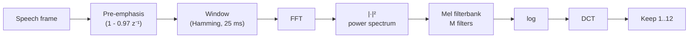

# Speech Processing — Exam Cheatsheets (Ch 5-10)

> One-page-each rules + formulas for the exam scope. Verify any specific number against the chapter notes if uncertain.

---

## Ch 5 — z-Transform

### Definition
```math
X(z) = \sum_{n=-\infty}^{\infty} x[n] z^{-n}
```
On unit circle ($z = e^{j\omega}$) → reduces to DTFT. **DTFT exists iff ROC contains the unit circle.**

### Common pairs (memorize)

| Sequence | Transform | ROC |
|---|---|---|
| $\delta[n]$ | $1$ | all $z$ |
| $\delta[n-m]$ | $z^{-m}$ | $\vert z\vert > 0$ |
| $a^n u[n]$ | $\dfrac{1}{1 - a z^{-1}}$ | $\vert z\vert > \vert a\vert$ |
| $-a^n u[-n-1]$ | $\dfrac{1}{1 - a z^{-1}}$ | $\vert z\vert < \vert a\vert$ |
| $n a^n u[n]$ | $\dfrac{a z^{-1}}{(1 - a z^{-1})^2}$ | $\vert z\vert > \vert a\vert$ |
| $a^n \cos(\omega_0 n) u[n]$ | $\dfrac{1 - a\cos(\omega_0) z^{-1}}{1 - 2a\cos(\omega_0) z^{-1} + a^2 z^{-2}}$ | $\vert z\vert > \vert a\vert$ |

> **Same algebra, different ROC = different signal.** *Always state ROC.*

### ROC rules (the practical ones)
- **Right-sided** (causal) → exterior $\vert z\vert > r_{\max\text{ pole}}$
- **Left-sided** (anti-causal) → interior $\vert z\vert < r_{\min\text{ pole}}$
- **Two-sided** → annulus
- **Finite-length** → entire plane (maybe minus 0 or ∞)
- ROC **never contains a pole**
- ROC is always **bounded by poles**

### Causality & stability (use these to answer most exam Q's)
- **Stable** ⇔ ROC includes unit circle
- **Causal** ⇔ ROC is exterior of outermost pole
- **Causal + stable** ⇔ **all poles inside unit circle**

### Properties (most useful)

| Property | Formula |
|---|---|
| Linearity | $a x_1 + b x_2 \leftrightarrow a X_1 + b X_2$ |
| Time shift | $x[n - n_0] \leftrightarrow z^{-n_0} X(z)$ |
| Convolution | $x \ast h \leftrightarrow X(z) H(z)$ |
| Exp modulation | $a^n x[n] \leftrightarrow X(z/a)$ |
| Differentiation | $n x[n] \leftrightarrow -z \dfrac{dX(z)}{dz}$ |
| Initial value | $x[0] = \lim_{z \to \infty} X(z)$ (causal) |
| Final value | $\lim_{n\to\infty} x[n] = \lim_{z \to 1}(z-1)X(z)$ (if stable) |

### System analysis recipe
1. Difference eq $\sum a_k y[n-k] = \sum b_k x[n-k]$ → divide by $a_0$ if needed
2. Take z-transform → $H(z) = \dfrac{\sum b_k z^{-k}}{\sum a_k z^{-k}}$
3. Factor → find poles/zeros
4. Check stability via pole locations

### Inverse z-transform (4 methods, in order of usefulness)
1. **Table look-up** — quickest if recognizable
2. **Partial fractions** — most common in exams
3. **Power series / long division** — gets first few samples
4. **Contour integration** — rarely used

### Pitfalls
- Forgetting to state ROC = wrong answer (different ROC = different signal).
- For causal signal, expand $X(z)$ in powers of $z^{-1}$.
- DTFT existence ⇔ stability ⇔ ROC contains unit circle.

---

## Ch 6 — Sampling & Reconstruction

### Core formulas

```math
x[n] = x_a(nT), \quad \Omega_s = \tfrac{2\pi}{T}, \quad f_s = \tfrac{1}{T}
```

Discrete frequency: $\omega = \Omega T$ (rad/sample).

### Sampled spectrum
```math
X_s(j\Omega) = \frac{1}{T} \sum_{k=-\infty}^{\infty} X(j(\Omega - k\Omega_s))
```
Spectrum **replicates** every $\Omega_s$, scaled by $1/T$.

### Nyquist–Shannon (the exam classic)
**Bandlimited** signal $X(j\Omega) = 0$ for $\vert\Omega\vert \geq \Omega_b$ is **perfectly recoverable** iff
```math
\Omega_s > 2\Omega_b \quad \Longleftrightarrow \quad f_s > 2 f_b
```
- Nyquist rate = $2 f_b$ = **minimum sampling rate**.
- $f_s/2$ = Nyquist frequency = max representable freq.

### Aliasing
- When $f_s \leq 2 f_b$, spectral copies overlap → **irreversible** corruption.
- For a sinusoid at $f$, alias $= |f - k f_s|$ folded into $[0, f_s/2]$.
- Always front-load an **anti-aliasing LPF** before the ADC.

### Reconstruction
- Ideal: sinc interpolation
```math
x_r(t) = \sum_k x[k] \, \mathrm{sinc}\!\left(\frac{t - kT}{T}\right)
```
- Practical: LPF in the DAC (zero-order-hold + reconstruction filter).
- Ideal reconstruction is **non-causal + infinite duration** → unrealizable.

### Practical chain
```
analog → anti-aliasing LPF → ADC (sample + quantize) → DSP → DAC → reconstruction LPF → analog out
```

### Pitfalls
- Aliasing is **irreversible** — must prevent at sampling time.
- "Bandlimited" is a mathematical idealization; real signals need anti-alias LPFs.
- Quantization adds noise; SNR ≈ 6.02 b + 1.76 dB for b-bit ADC.

---

## Ch 7 — STFT & Spectrogram

### STFT
```math
S[m, k] = \sum_{n} x[n] \, w[n - mH] \, e^{-j 2\pi k n / N}
```
- $m$ = frame index · $k$ = freq bin (0..N-1) · $H$ = hop · $N$ = FFT size · $w$ = window.
- Output: complex 2D matrix (freq bins × frames).

### Useful counts
For signal length $T_{\text{total}}$, frame size $L$, hop $H$, FFT size $N$:
- Number of frames = $\lfloor (T_{\text{total}} - L)/H \rfloor + 1$
- Number of frequency bins (real spectrum) = $N/2 + 1$
- Time resolution $\Delta t \approx L/f_s$
- Frequency resolution $\Delta f \approx f_s/N$ (bin spacing — actual resolution limited by main-lobe width of window)

### Uncertainty principle
```math
\Delta t \cdot \Delta f \geq \tfrac{1}{4\pi}
```
Can't resolve time AND frequency arbitrarily well.

### Window comparison

| Window | Main-lobe width | Sidelobe level | Use |
|---|---|---|---|
| Rectangular | narrowest ($\approx 2 f_s/L$) | $-13$ dB | rare in speech |
| Bartlett (triangular) | wider | $-27$ dB | educational |
| Hann | medium | $-31$ dB | general |
| **Hamming** | medium | $-41$ dB | **most common in speech** |
| Blackman | widest | $-58$ dB | high dynamic range |

**Trade-off**: narrow main lobe ↔ low sidelobes. Can't have both.

### Narrowband vs wideband (the classic dichotomy)

| | Window length | Resolves | Use for |
|---|---|---|---|
| **Narrowband** | long (~60 ms) | pitch harmonics (vertical striations) | F0, pitch tracking |
| **Wideband** | short (~6 ms) | formants (horizontal bands) + pitch periods (vertical lines) | formants, transients |

### Spectrogram = $\vert S[m,k]\vert^2$ in dB

Phoneme signatures:
- **Vowels**: 3-4 horizontal bands = formants F1-F3
- **Fricatives** (/s/, /f/, /sh/): broadband noise, high-freq emphasis, no formants
- **Stops** (/p/, /t/, /k/): silence + burst + VOT (voice-onset-time gap)
- **Nasals** (/m/, /n/): low energy + anti-formants (spectral nulls)
- **Diphthongs**: moving formants
- **Semivowels** (/w/, /l/, /r/, /y/): slow formant transitions

### Practical defaults
- 50% overlap (hop = $L/2$) is standard.
- For speech: Hamming, 25 ms / 10 ms hop.

### Pitfalls
- **Window length** determines resolution, NOT FFT size (FFT only sets bin density).
- Zero-padding sharpens the bin grid but doesn't improve real resolution.

---

## Ch 8 — Speech Signal Analysis

### Source-filter model (the centerpiece)
```math
P_L(z) = R(z) \cdot V(z) \cdot G(z) \cdot S(z)
```
- $S(z)$ = source: impulse train (voiced, period $N_p$) or random noise (unvoiced)
- $G(z)$ = glottal pulse shaper (voiced only)
- $V(z)$ = vocal tract = **all-pole filter**
- $R(z)$ = radiation = $1 - 0.99 z^{-1}$ (high-pass, fixes spectral tilt)
- $A_V$, $A_N$ = voiced / unvoiced gain selectors

### Vocal tract = all-pole filter
```math
V(z) = \frac{1}{1 + \sum_{k=1}^{p} a_k z^{-k}}
```
Poles $z_k = r_k e^{j\omega_k}$ ↔ **formants** $F_1, F_2, F_3$.

### Time-domain measures

**Short-time energy** (sensitive to loudness, sums squared samples):
```math
E_{\hat{n}} = \sum_{m} \big(x[m] \cdot w[\hat{n} - m]\big)^2
```

**Short-time magnitude** (less outlier-sensitive than energy):
```math
M_{\hat{n}} = \sum_{m} |x[m]| \cdot w[\hat{n} - m]
```

**Zero-crossing rate** (voiced vs unvoiced classifier):
```math
Z_{\hat{n}} = \tfrac{1}{2} \sum_{m} \big|\mathrm{sgn}(x[m]) - \mathrm{sgn}(x[m-1])\big| \cdot w[\hat{n} - m]
```
For pure sinusoid at $f_0$: ZCR $= 2 f_0 / f_s$ crossings per sample.

**Short-time autocorrelation** (pitch detection):
```math
R_{\hat{n}}(k) = \sum_{m} x[m] \, x[m+k] \, w[\hat{n}-m] \, w[\hat{n}-m-k]
```
Pitch period $T_p$ = **lag of first non-trivial peak** (skipping the always-largest peak at lag 0).
```math
F_0 = f_s / T_p
```

**AMDF** (Average Magnitude Difference Function — cheaper alternative):
```math
D_{\hat{n}}(k) = \sum_{m} |x[m] - x[m-k]| \, w[\hat{n}-m]
```
Pitch = lag of first **minimum** (not peak).

### Voicing decision rules

| | Energy | ZCR | Autocorr |
|---|---|---|---|
| Voiced (vowel) | HIGH | LOW | strong periodic peaks |
| Unvoiced (/s/, /f/) | low-mid | **HIGH** | no clear peak |
| Silence | LOW | low-mid | random / no peak |

### Formant rules of thumb

| Formant | Articulation |
|---|---|
| $F_1$ ↑ | mouth more **open** (/a/ vs /i/) |
| $F_2$ ↑ | tongue more **front** (/i/ vs /u/) |
| $F_3$ ↑ | less lip rounding |

Adult male: $F_1 \in [300, 900]$ Hz, $F_2 \in [800, 2500]$ Hz; female $\approx 15\%$ higher.

### Pitfalls
- Voicing decision is **multi-feature** — no single measure is reliable.
- Vocal-tract all-pole model **misses nasals** (which have zeros = anti-resonances).
- Autocorrelation at lag 0 is always max — pitch peak is the **first non-trivial** one.

---

## Ch 9 — Cepstral Analysis & MFCC

### Real cepstrum
```math
c[n] = \mathcal{F}^{-1} \{ \log | \mathcal{F}\{x[n]\} | \}
```
Domain = **quefrency** (units: seconds, or samples).

### Why it works — homomorphic deconvolution
- Time: $s[n] = e[n] \ast h[n]$ — convolution (hard).
- Spectrum: $S = E \cdot H$ — multiplication.
- **Log spectrum**: $\log S = \log E + \log H$ — **addition** ⇒ separable.
- IFFT → cepstrum: source (low-quefrency? high-quefrency?) → see below.

### Cepstrum domains
- **Low quefrency** (left) = **slowly varying** part of log spectrum = **spectral envelope** = vocal tract / formants
- **High quefrency** (right) = **rapidly varying** part = pitch harmonics = excitation source

### Pitch from cepstrum
- Search range for $F_0 \in [50, 400]$ Hz → quefrency range $[1/400, 1/50] = [2.5, 20]$ ms.
- Find peak in that range.
```math
F_0 = f_s / q_0
```
where $q_0$ is peak quefrency in samples.

### Liftering (filtering in quefrency)
- **Low-pass lifter** → keep low quefrency → **spectral envelope** (formants, vocal tract)
- **High-pass lifter** → keep high quefrency → **excitation** (pitch info)
- Cutoff: typically $0.5 \cdot T_p$ (half the pitch period) — must be **below** pitch quefrency.

### Reconstructing the envelope spectrum
```math
\text{envelope} = \mathrm{Re}\{\exp(\mathcal{F}\{c_{\text{lifted}}\})\}
```
- `exp` because cepstrum is **log** spectrum.
- `Re` to drop numerical-noise imaginary parts.

### Mel scale
```math
m = 2595 \cdot \log_{10}\!\left(1 + \frac{f}{700}\right) \quad\Leftrightarrow\quad f = 700 \cdot (10^{m/2595} - 1)
```
- Approx linear below 1 kHz, logarithmic above.

### Mel filterbank
- $M$ triangular filters (typical $M = 20$–$40$), equally spaced on Mel axis from 0 to $f_s/2$.
- Each filter sums weighted FFT-bin powers:
```math
E_m = \sum_k H_m[k] \cdot |X[k]|^2
```
- 1024 FFT bins → e.g. 26 Mel-band energies (massive perceptually-meaningful compression).

### MFCC pipeline (the 8 steps — MEMORIZE)



**DCT formula** (the one in your worksheet):
```math
\mathrm{MFCC}_d = \sum_{m=1}^{M} \log(E_m) \cdot \cos\!\left(\frac{\pi d (m - 0.5)}{M}\right), \quad d = 0, \ldots, M-1
```
Discard $d=0$ (= overall log-energy, redundant with the energy term added separately).

### Final feature vector (the 39-dim standard)
```math
\underbrace{12}_{\text{MFCC}} + \underbrace{1}_{\text{energy}} + \underbrace{13}_{\Delta} + \underbrace{13}_{\Delta\Delta} = 39
```

Δ formula (regression-style velocity, typical $N = 2$):
```math
\Delta c_t = \frac{\sum_{n=1}^{N} n (c_{t+n} - c_{t-n})}{2 \sum_{n=1}^{N} n^2}
```
ΔΔ = Δ of Δ (acceleration).

### One-line summary
> **MFCC = take the spectrum, warp the frequency axis to match the ear (Mel), smooth it (filterbank), take the log, DCT to keep the slow envelope — that's the vocal-tract shape, which distinguishes phonemes.**

### Pitfalls
- DCT, NOT IFFT (real-valued, decorrelating, easy to truncate).
- Discard $c_0$ (= log-energy, redundant).
- `exp` after IFFT in reconstruction — cepstrum is **log** spectrum.
- Lifter cutoff must be **below** pitch quefrency to cleanly separate envelope.

---

## Ch 10 — Linear Predictive Coding (LPC)

### All-pole speech model
```math
H(z) = \frac{G}{A(z)} = \frac{G}{1 - \sum_{k=1}^{p} a_k z^{-k}}
```

### Linear prediction
```math
\hat{s}[n] = \sum_{k=1}^{p} a_k \, s[n-k]
```

### Prediction error (residual)
```math
e[n] = s[n] - \hat{s}[n] = s[n] - \sum_{k=1}^{p} a_k \, s[n-k]
```
- **Voiced**: residual ≈ impulse train at pitch period $T_p$.
- **Unvoiced**: residual ≈ white noise.

### Minimization → Normal Equations (Yule-Walker)
Minimize $E = \sum_n e[n]^2$ → set $\partial E / \partial a_i = 0$:
```math
\sum_{k=1}^{p} a_k \, R(i - k) = R(i), \quad i = 1, 2, \ldots, p
```
Matrix form: $\mathbf{R}\mathbf{a} = \mathbf{r}$ where $\mathbf{R}$ is **Toeplitz** (built from autocorrelation values).

### Levinson-Durbin (O(p²) recursive solver — sketch)
1. Init: $E_0 = R(0)$, $a_0 = 1$.
2. For $i = 1, 2, \ldots, p$:
   ```math
   k_i = -\frac{R(i) + \sum_{j=1}^{i-1} a_j^{(i-1)} R(i-j)}{E_{i-1}}
   ```
   ```math
   a_i^{(i)} = k_i
   ```
   ```math
   a_j^{(i)} = a_j^{(i-1)} + k_i \cdot a_{i-j}^{(i-1)}, \quad j = 1, \ldots, i-1
   ```
   ```math
   E_i = (1 - k_i^2) E_{i-1}
   ```

### Reflection coefficients (PARCOR) $k_i$
- Physical: model wave reflections at junctions of an **acoustic-tube** model of the vocal tract.
- **Stability check**: $|k_i| < 1$ for **all** $i$ ⇔ filter is stable.

### Order selection rule
```math
p \approx F_{s,\text{kHz}} + 2 \text{ to } 4
```
- $f_s = 8$ kHz → $p \approx 10$–$12$
- $f_s = 16$ kHz → $p \approx 18$–$20$
- Rationale: ~2 poles per formant + ~3 formants × ~2 + 2 spectral-balance extras.

### LPC spectrum interpretation
```math
|H(e^{j\omega})|^2 = \frac{G^2}{|A(e^{j\omega})|^2}
```
For each pole $z_k = r_k e^{j\omega_k}$:
- **Formant frequency** = $\omega_k \cdot f_s / (2\pi)$
- **Formant bandwidth** $\propto -\ln(r_k)$ (pole near unit circle = sharp/narrow formant)

### Applications
- **Speech coding** (CELP, vocoders) — transmit $\{a_k, G, e[n]\}$, save bandwidth.
- **Formant tracking** — read pole frequencies frame-by-frame.
- **Pitch detection** — autocorrelation of LPC residual.
- **Speaker ID** — LPC coefficients as features.

### Pitfalls
- LPC is **all-pole** — misses **nasals + fricatives** (have zeros / anti-resonances).
- Need ALL $|k_i| < 1$ for stability (not just some).
- Order $p$ matters: too low → miss formants; too high → spurious sharp poles, overfitting.
- Frame-by-frame (assume stationarity over ~20-30 ms).

---

## Cross-chapter at-a-glance

### Source-filter thread (Ch 8 / 9 / 10)
- **Ch 8** = introduce model; measure with energy/ZCR/autocorr.
- **Ch 9** = separate source/filter via log + IFFT (cepstrum) or DCT (MFCC).
- **Ch 10** = estimate filter coefficients directly (LPC).

### All-pole vocal tract
Same model object in Ch 8 ($V(z)$), Ch 10 ($1/A(z)$). LPC fits the all-pole filter; cepstrum lifters it out; MFCC compresses its log-mel response.

### "Log trick" thread (Ch 9)
Convolution → multiplication → addition (after log) → separable. The whole reason for both cepstrum and MFCC.

### Time-frequency thread (Ch 7 ↔ Ch 9)
STFT (Ch 7) gives short-time spectrum; MFCC (Ch 9) processes each STFT frame into features. STFT window choice (narrowband vs wideband) impacts what you can see (F0 vs formants).

### Sampling thread (Ch 6 ↔ all)
Everything else assumes a sampled signal. Nyquist → discrete-time signal → z-transform / DTFT / DFT.

---

## Final exam-day mental sequence

1. **What domain** is the question in? Time / freq / z / quefrency / Mel?
2. **What's given**: signal / impulse response / poles? difference equation?
3. **What's asked**: stability / pitch / formants / feature vector?
4. **Which formula bridges the two**? (Look up above.)
5. **Sanity check**: units, ROC, stability, dimensions.

**Good luck.**
