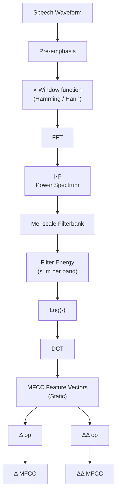

# Chapter 9 — Cepstral Analysis & Mel-Frequency Cepstral Coefficients (MFCC)

---

## Bird's eye view

- The **cepstrum** is the inverse DFT of the log-magnitude spectrum — a "spectrum of a spectrum" — living in the **quefrency** domain (measured in seconds, like time).
- Speech obeys the **source-filter model**: $s[n] = e[n] \ast h[n]$. The cepstrum converts convolution into addition, allowing excitation (high quefrency) and vocal tract (low quefrency) to be separated by **liftering**.
- **Homomorphic deconvolution** is the three-step pipeline: DFT → log|·| → inverse DFT; liftering in quefrency then separates source from filter.
- A cepstrum plot of a voiced vowel shows a smooth low-quefrency bulge (vocal tract) plus a sharp peak at $q_0$ (pitch period); pitch frequency = $F_s / q_0$.
- **MFCCs** are the dominant ASR feature: they mimic human hearing via a Mel-scale filterbank, and compress the result via DCT, yielding ~12 static coefficients per frame.
- The full MFCC pipeline is: pre-emphasis → framing/windowing → FFT → power spectrum → Mel filterbank → log → DCT → (optionally) delta and delta-delta features.
- A standard ASR feature vector has **39 dimensions**: 12 static + 1 energy + 12 delta + 12 delta-delta + 1 delta-energy + 1 delta-delta-energy.

---

## Detailed notes

### 1. What Is the Cepstrum?

#### 1.1 Historical context

- Developed in the 1960s while studying echoes in seismic signals.
- By the 1970s it became the audio feature of choice for speech recognition and speaker identification.
- Applied to music processing from the 2000s onward.

#### 1.2 Definition

The **cepstrum** is defined as the inverse DFT of the log-magnitude of the DFT:

```math
c[n] = \mathcal{F}^{-1}\left\{ \log \left| \mathcal{F}\{x[n]\} \right| \right\}
```
In words:
1. Take the DFT of the time-domain signal $x[n]$ to get the spectrum $\mathcal{F}\{x[n]\}$.
2. Take the magnitude $|\mathcal{F}\{x[n]\}|$ (log spectrum when logs are applied).
3. Apply the inverse DFT to get $c[n]$ — the cepstrum.

- The domain of $c[n]$ is called **quefrency** (unit: seconds, analogous to time).
- Useful for decomposing signals that have been **convolved** (source-filter model).

#### 1.3 Cepstral vocabulary (reversed-word naming)

| Standard term   | Cepstral term     | Meaning in cepstral context                      |
|-----------------|-------------------|--------------------------------------------------|
| Spectrum        | Cepstrum          | Inverse FT of log-spectrum                       |
| Frequency       | Quefrency         | Variable of the cepstrum (units: seconds)        |
| Filtering       | Liftering         | Operation on the cepstrum (quefrency domain)     |
| Harmonic        | Rahmonic          | Multiple of fundamental quefrency                |
| Low-pass filter | Low-pass lifter   | Keeps low quefrencies (vocal tract component)    |
| High-pass filter| High-pass lifter  | Keeps high quefrencies (excitation/pitch)        |

---

### 2. Why Cepstrum for Speech? — The Source-Filter Model

#### 2.1 Speech production model

Speech is modeled as a convolution:

```math
s[n] = e[n] \ast h[n]
```
where:
- $e[n]$ = excitation signal (voiced speech: periodic impulse train at pitch period $T_0$; unvoiced: white noise)
- $h[n]$ = vocal tract impulse response (the filter)

In the frequency domain, convolution becomes multiplication:

```math
S(k) = E(k) \cdot H(k)
```
#### 2.2 How the cepstrum decouples source and filter

Taking the log converts multiplication to addition:

```math
\log S(k) = \log E(k) + \log H(k)
```
Applying the inverse DFT:

```math
c_s[n] = c_e[n] + c_h[n]
```
This is the key insight: **in the cepstral domain the contributions of excitation and vocal tract are additive and separable by quefrency**.

- The **vocal tract** response $h[n]$ is a slowly varying spectral envelope → maps to **low quefrency** components $c_h[n]$.
- The **excitation** $e[n]$ has rapid harmonic structure (pitch and its overtones) → maps to **high quefrency** components $c_e[n]$, with a peak at the pitch period $q_0$.

---

### 3. Real Cepstrum vs. Complex Cepstrum

#### 3.1 Real cepstrum

For most speech tasks (MFCCs, formant analysis, speaker recognition), we use the **real cepstrum**:

```math
c[n] = \mathcal{F}^{-1}\left\{ \log |X(k)| \right\}
```
- Uses only the log-magnitude; **discards phase**.
- The spectral envelope is the important information; phase is perceptually less relevant.
- Simpler and more numerically stable.

#### 3.2 Complex cepstrum

```math
\hat{c}[n] = \mathcal{F}^{-1}\left\{ \log X(k) \right\}
```
where $\log X(k) = \log|X(k)| + j\arg X(k)$.

- Retains phase information via the unwrapped phase $\arg X(k)$.
- Required for exact signal reconstruction (minimum phase analysis, deconvolution, image synthesis).
- Most speech processing applications use the real cepstrum.

---

### 4. Homomorphic Deconvolution

#### 4.1 The three-step pipeline

```math
s[n] \xrightarrow{\mathcal{F}} \log|\cdot| \xrightarrow{\mathcal{F}^{-1}} c[n]
```
Step by step:
1. **Linear transform (DFT)**: convolution $s[n] = e[n]\ast h[n]$ becomes multiplication $S(k) = E(k)\cdot H(k)$.
2. **Logarithm**: multiplication becomes addition: $\log S(k) = \log E(k) + \log H(k)$.
3. **Inverse linear transform (IDFT)**: returns to a time-like (quefrency) domain where the two components are additive: $c_s[n] = c_e[n] + c_h[n]$.

#### 4.2 Liftering (quefrency-domain filtering)

Once in the cepstral domain, apply a lifter (a window in quefrency):

- **Low-pass lifter** (keep $n \leq N_c$): isolates vocal tract component $c_h[n]$.
- **High-pass lifter** (keep $n > N_c$): isolates excitation component $c_e[n]$.
- $N_c$ is the **cutoff quefrency** that separates the two regions.

Ideal low-pass lifter formula:

```math
l_{lp}[n] = \begin{cases} 1 & \text{if } |n| \leq N_c \\ 0 & \text{otherwise} \end{cases}
```
Filtered cepstrum:

```math
c_{\text{filter}}[n] = c[n] \cdot l_{lp}[n]
```
Recovering the spectral envelope (vocal tract filter frequency response):

```math
H(k) = \exp\!\left( \mathcal{F}\{ c_{\text{filter}}[n] \} \right)
```
This gives the smooth spectral envelope showing the formant peaks.

#### 4.3 Cepstral coefficients for speech recognition

To represent the spectral envelope compactly, keep only the first $K$ low-quefrency coefficients (typically $K = 12$–$20$):

```math
\mathbf{c} = [c_0,\, c_1,\, c_2,\, \ldots,\, c_{K-1}]
```
These $K$ coefficients:
- Represent the spectral envelope (vocal tract shape / formants).
- Discard high-quefrency details (pitch, noise, speaker-specific idiosyncrasies).
- Reduce channel variation effects.

---

### 5. Cepstrum of a Voiced Vowel — Diagram Description

A cepstrum plot of a voiced vowel (x-axis: quefrency in ms, y-axis: cepstral magnitude) shows:

- A **smooth, decaying region from 0 to ~2 ms**: this is $c_h[n]$, the vocal tract contribution. It represents the slowly-varying spectral envelope.
- A **sharp, prominent peak at $q_0$** (e.g., $q_0 = 8\text{ms} \Rightarrow F_0 = 1/0.008 = 125\text{Hz}$): this is the pitch period. For a female voice, $q_0 \approx 4\text{ms} \Rightarrow F_0 \approx 250\text{Hz}$.
- **No peak** in the high quefrency region for unvoiced speech (the source is noise, not periodic).

The cutoff quefrency $N_c$ is placed between 2 ms and $q_0$ so that:
- Everything below $N_c$ (low-pass) = vocal tract.
- The peak at $q_0$ and above (high-pass) = excitation (pitch).

---

### 6. Applications of Cepstral Analysis

#### 6.1 Pitch detection via cepstrum

Procedure (example: word "Matlab" spoken by a woman):
1. Extract a voiced segment (e.g., vowel /ae/ from 0.1–0.25 s).
2. Compute the cepstrum $c[n]$.
3. Search for the maximum peak in the quefrency range 2–10 ms (corresponding to pitch range 100–500 Hz).
4. The quefrency of the peak = pitch period $q_0$.
5. Convert to fundamental frequency: $F_0 = F_s / q_0$.

Example result: $q_0 = 4.18\text{ms} \Rightarrow F_0 = 239.29\text{Hz}$.

#### 6.2 Short-time homomorphic analysis

For time-varying speech (the word /SH EY D/):
- Apply the cepstrum to overlapping short frames (e.g., 15 windows separated by 100 samples).
- Panel (a): short-time log spectra showing the harmonic structure (peaks at F1, F2, F3 — the formants visible as the bold spectral envelope) changing over time.
- Panel (b): short-time cepstra — compact, stable representation; the low-quefrency part tracks the formant envelope across the fricative-to-vowel transition.

---

### 7. From Cepstrum to MFCCs — Motivation

#### 7.1 Perceptual requirements for ASR features

Two key facts about human speech perception:
1. We need the **spectral envelope** to characterize speech sounds — not the full harmonic structure.
2. Human hearing is **not equally sensitive** to all frequency bands: it has non-linear (perceptual) sensitivity, more acute at low frequencies, compressed at high frequencies.

Evidence: a 100 Hz impulse train and a 40 Hz impulse train through the **same vocal-tract filter** produce very different harmonic structures in the spectrum, yet the same phoneme is perceived. What matters is the envelope, not the harmonics.

#### 7.2 The Mel scale

The Mel scale maps physical frequency (Hz) to perceived pitch (mel), modeling human auditory perception:

```math
\text{Mel}(f) = 2595 \cdot \log_{10}\!\left(1 + \frac{f}{700}\right)
```
Properties:
- **Linear** below ~1 kHz: equal mel steps = equal Hz steps.
- **Logarithmic** above ~1 kHz: equal mel steps = larger and larger Hz steps.
- Inverse: $f = 700 \cdot \left(10^{m/2595} - 1\right)$

The Mel scale curve (y-axis: mel, x-axis: Hz) is concave, steeply rising at low Hz and flattening above 1 kHz, reaching ~3000 mel at 10000 Hz.

#### 7.3 Two approaches to capturing the spectral envelope

| Approach       | Method                                          | Use case                              |
|----------------|-------------------------------------------------|---------------------------------------|
| **MFCCs**      | Log Mel-filterbank energies + DCT               | ASR, speaker recognition (preferred)  |
| **Mel-Cepstrum** | Inverse DFT applied to spectrum directly      | TTS synthesis (preserves more detail) |

MFCCs are the preferred choice for recognition tasks.

---

### 8. The Full MFCC Pipeline

The block diagram flows as follows:



#### Step 1: Pre-emphasis

**Problem**: speech spectra exhibit a natural **spectral tilt** — high frequencies contain less energy than low frequencies, caused by the glottal pulse shape (roughly -6 dB/octave roll-off above $F_0$).

**Solution**: apply a first-order high-pass FIR filter:

```math
x[n] = x'[n] - \alpha \cdot x'[n-1]
```
where $\alpha$ is the pre-emphasis coefficient, typically $\alpha = 0.97$.

Effect: boosts high-frequency energy to flatten the spectrum, improving the signal-to-noise ratio at high frequencies and giving the acoustic model more useful information. The spectral slice of vowel /aa/ before pre-emphasis shows a clear downward tilt; after pre-emphasis the spectrum is approximately flat.

Transfer function: $H(z) = 1 - \alpha \cdot z^{-1}$ (a simple differentiator).

#### Step 2: Framing (Windowing — Part 1)

**Problem**: the DFT assumes stationarity (same spectral content throughout), but speech is non-stationary.

**Solution**: divide the signal into short overlapping **frames** using a tapered window.

Standard parameters:
- Frame size: **25 ms** (e.g., 400 samples at 16 kHz)
- Frame step (hop): **10 ms** (e.g., 160 samples at 16 kHz)
- Each frame overlaps the previous by 15 ms.

#### Step 3: Windowing (Windowing — Part 2)

Apply a window function $w[n]$ (e.g., **Hamming window**) to each frame to reduce spectral leakage at frame edges:

```math
w[n] = 0.54 - 0.46 \cdot \cos\!\left(\frac{2\pi n}{N-1}\right)
```
The windowed frame $x_w[n] = x[n] \cdot w[n]$ tapers to zero at both ends, preventing discontinuities from producing high-frequency artifacts in the FFT.

#### Step 4: FFT — Magnitude and Power Spectrum

Apply the DFT (FFT) to each windowed frame $t$:

```math
X_t[k] = \text{DFT}\{x_t[n]\} \qquad k = 0, 1, \ldots, N-1
```
- Magnitude spectrum: $|X_t[k]|$
- **Power spectrum**: $|X_t[k]|^2$

The power spectrum is preferred because squaring amplifies the dominant spectral peaks ("more peaky") and suppresses small values, making the filterbank energies more discriminative.

#### Step 5: Mel Filterbank

A bank of $M$ triangular bandpass filters, spaced **uniformly on the Mel scale** (which means uniformly spaced in Hz below 1 kHz, logarithmically spaced in Hz above 1 kHz).

Filterbank diagram: $M$ overlapping triangular filters covering the frequency axis from a low frequency $f_l$ to a high frequency $f_h$. Filters are narrow at low frequencies (fine resolution) and wide at high frequencies (coarser resolution) — matching the Mel scale. Each filter's peak weight = 1.

Formal definition of filter $m$ ($m = 1, 2, \ldots, M$):

```math
H_{t,m}[k] = \begin{cases}
0 & k < f[m-1] \\[4pt]
\dfrac{k - f[m-1]}{f[m] - f[m-1]} & f[m-1] \leq k \leq f[m] \\[6pt]
\dfrac{f[m+1] - k}{f[m+1] - f[m]} & f[m] \leq k \leq f[m+1] \\[4pt]
0 & k > f[m+1]
\end{cases}
```
The filterbank center frequencies in FFT bins are:

```math
f[m] = \frac{N}{F_s} \cdot B^{-1}\!\left( B(f_l) + m \cdot \frac{B(f_h) - B(f_l)}{M+1} \right)
```
where $B$ is the Mel-scale function $\text{Mel}(f)$ above, $B^{-1}$ is its inverse, $f_l$ and $f_h$ are the lowest and highest frequencies of the filterbank, $F_s$ is the sampling frequency, and $N$ is the FFT size.

Each filter output represents the **energy in one perceptual frequency band**.

#### Step 6: Log Filter Energies (Log Mel Filterbank = MELSPEC)

The log-energy of the $m$-th Mel filter at frame $t$:

```math
MF_t[m] = \log_{10}\!\left( \sum_{k=0}^{N-1} H_{t,m}[k] \cdot |X[k]|^2 \right) \qquad 1 \leq m \leq M
```
The log is applied because:
- Human loudness perception is roughly logarithmic.
- It compresses the dynamic range.
- It makes the following DCT step more effective (additive structure).

The resulting $M$-dimensional vector at each frame is called **MELSPEC** (log Mel filterbank features). Taking only MELSPEC (without the DCT) is sufficient for many modern deep-learning-based ASR systems.

#### Step 7: Discrete Cosine Transform (DCT)

Since the log power spectrum is real and symmetric, the inverse DFT reduces to a DCT. Apply DCT to the $M$ log filter energies to get the MFCC coefficients:

```math
\text{MFCC}_t[d] = \sum_{m=1}^{M} MF_t[m] \cdot \cos\!\left( \pi \cdot d \cdot \frac{m - \tfrac{1}{2}}{M} \right)
```
for $d = 1, 2, \ldots, N_{\text{MFCC}}$.

Key points:
- Typically $N_{\text{MFCC}} = 12$ and $M = 24$ (fewer MFCCs than Mel filters).
- The DCT **decorrelates** the filterbank energies (adjacent filters overlap and are correlated; DCT produces approximately uncorrelated coefficients).
- Coefficients at $d = 1, 2, \ldots, 12$ capture progressively finer spectral envelope shape.
- The **energy feature** (MFCC[0]) is often replaced by the log frame energy:

```math
\text{logEng} = \log\!\left( \sum_t |x[k]|^2 \right)
```
because the DCT coefficients themselves do not capture total frame energy.

---

### 9. Dynamic MFCC Features (Delta and Delta-Delta)

Speech is inherently **dynamic** — spectral properties change over time. Static MFCCs capture a single frame's spectral shape but miss the trajectory.

**Delta MFCC (first-order time derivative)**: estimates the rate of change of each MFCC coefficient across frames:

```math
\delta_t[d] = \frac{\displaystyle\sum_{\tau=1}^{R} \tau \cdot \bigl(c_{t+\tau}[d] - c_{t-\tau}[d]\bigr)}{2\displaystyle\sum_{\tau=1}^{R} \tau^2}
```
(Often computed as a simple difference over a context window of $R$ frames, e.g., $R = 2$.)

**Delta-Delta MFCC (second-order derivative)**: apply the same delta operation to the delta features — captures spectral acceleration.

Standard feature vector composition (per frame):

| Component            | Dimension |
|----------------------|-----------|
| Static MFCC          | 12        |
| Log energy           | 1         |
| Delta MFCC           | 12        |
| Delta energy         | 1         |
| Delta-delta MFCC     | 12        |
| Delta-delta energy   | 1         |
| **Total**            | **39**    |

---

### 10. Typical MFCC Parameter Values

| Parameter                  | Typical value       |
|----------------------------|---------------------|
| Window size                | 25 ms               |
| Window shift               | 10 ms               |
| Pre-emphasis coefficient   | $\alpha = 0.97$     |
| Number of Mel filters M    | 24 (or 26, 40)      |
| Number of MFCCs $N_{\text{MFCC}}$ | 12           |
| Energy feature             | 1                   |
| Delta and delta-delta      | 12 + 12             |
| Total feature vector dim.  | 39                  |

---

### 11. MFCCs vs. Mel-Cepstrum — Comparison

Both aim to capture the **spectral envelope** without the harmonic structure:

**MFCCs** (preferred for ASR):
- Log Mel-filterbank → DCT
- Smoothed, perceptually weighted
- 12–20 compact coefficients per frame
- Decorrelated features

**Mel-Cepstrum** (preferred for TTS):
- Inverse DFT applied directly to the spectrum
- Preserves finer spectral detail (formants, harmonics, spectral fine structure)
- Used where natural-sounding voice quality is required

---

### 12. Worked Example — Full MFCC Computation

**Scenario**: 16 kHz speech, $N = 400$ point FFT, $M = 6$ Mel filters, compute MFCC for one frame.

1. **Pre-emphasis**: $x[n] = x'[n] - 0.97\cdot x'[n-1]$ (flatten spectrum).
2. **Window**: multiply 400-sample frame by Hamming window.
3. **FFT**: compute $X[k]$ for $k = 0\ldots399$.
4. **Power spectrum**: $P[k] = |X[k]|^2$.
5. **Mel filterbank**: compute $f[0]\ldots f[7]$ (center frequencies for $M=6$ filters need $M+2=8$ values) using the Mel formula with $f_l=0$, $f_h=8000\text{Hz}$.
6. **Filter energies**: $MF[m] = \log_{10}\left(\sum_k H_m[k]\cdot P[k]\right)$ for $m=1\ldots6$.
7. **DCT**: $\text{MFCC}[d] = \sum_{m=1}^{6} MF[m] \cdot \cos\left(\pi\cdot d\cdot(m-0.5)/6\right)$ for $d=1\ldots12$ (but only $d \leq M$ here, so $d=1\ldots6$ meaningful).
8. **Result**: a 6-dimensional static MFCC vector for this frame.

---

## Key terms (glossary)

- **Cepstrum** — inverse DFT of the log-magnitude spectrum; the "spectrum of a spectrum."
- **Quefrency** — the domain variable of the cepstrum, analogous to time (measured in seconds).
- **Liftering** — filtering operation applied in the quefrency (cepstral) domain; the cepstral analogue of filtering.
- **Low-pass lifter** — keeps low quefrency components; extracts the vocal tract (spectral envelope).
- **High-pass lifter** — keeps high quefrency components; extracts the excitation (pitch/harmonics).
- **Rahmonic** — a multiple of the fundamental quefrency (analogous to harmonic in frequency domain).
- **Real cepstrum** — cepstrum computed using only $\log|X(k)|$; discards phase.
- **Complex cepstrum** — cepstrum computed using $\log X(k) = \log|X(k)| + j\arg X(k)$; retains phase.
- **Homomorphic deconvolution** — the transform pipeline (DFT → log → IDFT) that converts convolution into addition.
- **Source-filter model** — speech = excitation * vocal-tract filter; $s[n] = e[n] \ast h[n]$.
- **Cutoff quefrency ($N_c$)** — the lifter threshold separating low-quefrency (vocal tract) from high-quefrency (excitation) cepstral regions.
- **Spectral tilt** — the natural -6 dB/octave fall-off of speech energy at high frequencies, caused by the glottal pulse.
- **Pre-emphasis** — first-order high-pass filter applied to flatten spectral tilt; $x[n] = x'[n] - \alpha\cdot x'[n-1]$, $\alpha \approx 0.97$.
- **Mel scale** — perceptual frequency scale: $\text{Mel}(f) = 2595\cdot\log_{10}(1 + f/700)$; linear below 1 kHz, logarithmic above.
- **Mel filterbank** — bank of $M$ overlapping triangular bandpass filters uniformly spaced on the Mel scale.
- **MELSPEC** — log Mel filterbank features ($MF_t[m]$); the output before DCT.
- **MFCC** — Mel-Frequency Cepstral Coefficients; DCT of log Mel filterbank energies; standard ASR feature.
- **DCT (Discrete Cosine Transform)** — decorrelates filterbank energies; reduces $M$ filter outputs to $N_{\text{MFCC}}$ coefficients.
- **Delta MFCC** — first-order time derivative of static MFCCs; captures spectral dynamics.
- **Delta-Delta MFCC** — second-order time derivative; captures spectral acceleration.
- **39-dimensional feature vector** — standard ASR feature: 12 static + 1 energy + 12 delta + 1 delta-energy + 12 delta-delta + 1 delta-delta-energy.
- **Pitch period ($q_0$)** — the quefrency of the main cepstral peak; $F_0 = F_s / q_0$.

---

## Exam targets

1. **Define the cepstrum** mathematically and explain the meaning of "quefrency." Write: $c[n] = \mathcal{F}^{-1}\{\log|\mathcal{F}\{x[n]\}|\}$.

2. **Derive the source-filter separation** in the cepstral domain: starting from $s[n] = e[n]\ast h[n]$, show step by step how $c_s[n] = c_e[n] + c_h[n]$ follows by taking log of the DFT.

3. **Distinguish real cepstrum from complex cepstrum**: give both formulas, state which discards phase and why the real cepstrum is preferred in speech recognition.

4. **Describe homomorphic deconvolution** with the three-step diagram: $s[n] \to \mathcal{F} \to \log|\cdot| \to \mathcal{F}^{-1} \to c[n]$. State what liftering is, write the ideal low-pass lifter formula, and explain how to recover the spectral envelope $H(k)$.

5. **Interpret a cepstrum plot** of a voiced vowel: identify the vocal tract region (low quefrency, smooth decay), the pitch peak (sharp spike at $q_0$), and explain how to estimate $F_0$ from $q_0$.

6. **Write the Mel scale formula** $\text{Mel}(f) = 2595\cdot\log_{10}(1+f/700)$ and sketch the curve. Explain why it is linear below 1 kHz and logarithmic above.

7. **List and explain all steps of the MFCC pipeline**: pre-emphasis (equation + purpose), framing (typical 25 ms / 10 ms), windowing (Hamming), FFT + power spectrum, Mel filterbank (triangular filter formula), log, DCT (formula), delta/delta-delta.

8. **Write the triangular filterbank formula** $H_{t,m}[k]$ for a bank of $M$ filters and the center-frequency formula $f[m]$ in FFT bins. Explain how $f_l$, $f_h$, $N$, $F_s$, $M$ relate.

9. **Write the DCT formula** for MFCCs: $\text{MFCC}_t[d] = \sum_{m=1}^{M} MF_t[m]\cdot\cos(\pi\cdot d\cdot(m-1/2)/M)$, and explain why the DCT is applied instead of a full inverse DFT.

10. **Compute the dimension of a standard ASR feature vector** and list all components: $12 + 1 + 12 + 1 + 12 + 1 = 39$. Explain what delta and delta-delta features add.

11. **Compare MFCCs and Mel-Cepstrum**: which is preferred for ASR, which for TTS, and why.

---

## Pitfalls

- **Cepstrum domain is NOT time** — it is quefrency. Confusing "quefrency" with time will cost marks; quefrency has units of seconds but is a different domain.

- **Low-pass lifter → vocal tract; high-pass lifter → excitation** — students often reverse this. Remember: the vocal tract spectral envelope is slow-varying (low quefrency); the pitch harmonics are rapid (high quefrency).

- **Real vs. complex cepstrum formulas**: real cepstrum uses $\log|X(k)|$ (magnitude only); complex cepstrum uses $\log X(k) = \log|X(k)| + j\cdot\arg X(k)$. Do not confuse the two.

- **MFCC coefficients are NOT the log Mel filterbank outputs (MELSPEC)** — the DCT step is what produces MFCCs from MELSPEC. Many students stop at log Mel filterbank and call the result MFCC.

- **The DCT replaces the inverse DFT** because the log power spectrum is real and symmetric — this is not an approximation, it is exact.

- **Pre-emphasis is applied before FFT**, not after. Its transfer function is $H(z) = 1 - \alpha\cdot z^{-1}$ (a highpass differentiator). The typical value $\alpha = 0.97$ is standard; some variants use 0.95.

- **Power spectrum, not magnitude spectrum** is passed to the Mel filterbank in the standard MFCC pipeline — squaring $|X_t[k]|^2$ before the filterbank is important.

- **$F_0$ from cepstrum**: $F_0 = F_s / q_0$ (NOT $1/q_0$ alone — you must divide by sampling frequency). $q_0$ is in samples; $F_s$ converts to Hz.

- **39 dimensions**: memorize the breakdown $(12+1+12+1+12+1)$ and be able to justify each term. The "1" terms are energy and its derivatives — they are separate from the cepstral coefficients.

- **Liftering cutoff $N_c$ must be between the vocal tract region and $q_0$** — if $N_c > q_0$, you will include the pitch peak in the "vocal tract" estimate, ruining the separation.
